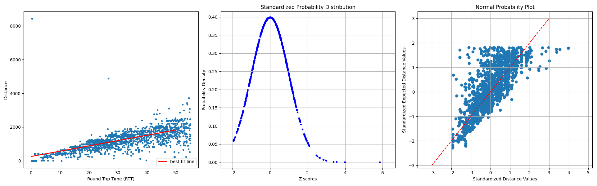

# DistanceToRTTMapping
exploring the relationship between Round Trip Time(RTT) and and Distance in KM, using the free RIPE ATLAS API and python. Retracing the steps of the following older paper:
> [**Spotter: A model based active geolocation service**]([https://doi.org/10.1109/INFCOM.2011.5935165](https://doi.org/10.1109/INFCOM.2011.5935165))  
> Laki, Sándor and Mátray, Péter and Hága, Péter and Sebők, Tamás and Csabai, István and Vattay, Gábor <br>
> *2011 Proceedings IEEE INFOCOM*

The purpose of this repsitory is to validate/compare the observations made about the ping vs distance relationship in the Spotter paper. here is a comparison of the results:
### Original


### Recreated


## Requirements
If you want to recreate the results you will need the following:
- Anaconda
- 500mb free space for anaconda env and data from RIPE ATLAS API
- Internet connection to access RIPE ATLAS API
## Usage
open terminal with anaconda activated. Then execute:
```
conda create -n distance_rtt python=3.11
conda activate distance_rtt
pip install -r requirements.txt
```
Then, to execute the script, simply run:
```
python main.py
```
## Discussion
There are some noticable differences. Firstly, the normality assumption has become less representitiave as the latencies are now right skewed. This could be a result of advances in networking efficiency over the last 14 years, now most nodes in the network are less bottlenecked by network congestion as the internet becomes more efficient. It is worth noting that the measurements used are taken in ideal conditions, with dedicated devices designed for this purpose, consumer devices will have higher RTT on average. measurements had to be clipped at RTT's of less than 80ms as the results were simply too noisy beyond that point to fit any sort of curve. A decision was made to go with a linear model as minimal gains were made with a polynomial one and the data gave rise to a polynomial with -ve coefficients which would trend down at certain points, which is not a possible relationship that the data can have.
## Implications
The spotter paper makes use of the normality assumption to nicely model a probability distribution function where std. deviation is a function of distance in order to use multilateration to discover the location of an IP address. This seems to no longer be reliable. Perhaps a return to the flat rings approach is required, where by process of elimination we have a uniform zone of possibilties. Not the best, but still more reliable and much more trustworthy than probabilistic approaches given the volitility in the data.
## Limitations
- Not enough data: roughly ~5000 data points were used, with >1000 unique probes. data was selected at random from the cloud atlas website which can be found [here](https://atlas.ripe.net/measurements/public), and then the ID's were taken and plugged into the API in the python script for ease of use.
- RIPE ATLAS: These probes are compeletely different from the ones used in the Spotter paper so a comparison may not be completely fair
